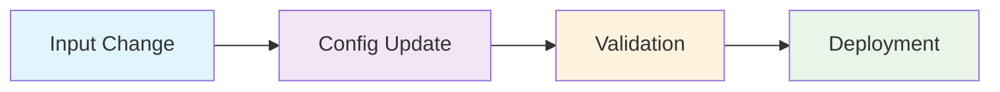

# Elastic Agent Configuration and Kubernetes Deployment

A complete CI/CD pipeline for managing Elastic Agent configurations and deploying them to Kubernetes clusters using GitHub Actions, HashiCorp Vault, and Kustomize.

## 🚀 Quick Start

### Prerequisites
- GitHub repository with Actions enabled
- HashiCorp Vault with OIDC authentication configured
- Kubernetes clusters with appropriate access
- Kubeconfig files stored in Vault

### Basic Usage

1. **Add/Modify Input Configuration**
   ```bash
   # Create or edit input files in subdirectories
   inputs/loc1/google_http/http_google.yml
   inputs/loc2/filebeat/filebeat_config.yml
   ```

2. **Create Pull Request**
   - Changes to `inputs/*/*/**.yml` files automatically trigger the config update workflow
   - The workflow updates the main `elastic-agent.yml` files
   - Kubernetes manifests are validated automatically

3. **Deploy to Production**
   - **Automatic**: Merge PR to main branch for automatic deployment
   - **Manual**: Use GitHub Actions "Deploy to Kubernetes" workflow

## 📋 Features

- ✅ **Automated Configuration Management** - Input files automatically merged into main configuration
- ✅ **Multi-Environment Support** - Location-based deployment (loc1 → cluster1, loc2 → cluster2)
- ✅ **Kubernetes Validation** - Dry-run validation before deployment
- ✅ **Secure Deployment** - Vault integration for kubeconfig management
- ✅ **Branch Protection** - Deployment restricted to main branch only
- ✅ **Error Handling** - Comprehensive validation and error reporting
- ✅ **Audit Trail** - Complete workflow history and logging

## 🏗️ Architecture

The system consists of three interconnected GitHub Actions workflows:



1. **Config Update Workflow** - Merges input files into main configuration
2. **Validation Workflow** - Validates Kubernetes manifests
3. **Deployment Workflow** - Deploys to Kubernetes clusters

For detailed architecture information, see [architecture.md](architecture.md).

## 📁 Project Structure

```
├── .github/workflows/
│   ├── update_config.yml              # Config update workflow
│   ├── validate-kubernetes-manifests.yml  # Validation workflow
│   └── deploy-kubernetes.yml          # Deployment workflow
├── inputs/
│   ├── loc1/
│   │   ├── elastic-agent.yml          # Main config (auto-generated)
│   │   ├── agent-deployment.yml       # Kubernetes deployment
│   │   ├── kustomization.yml          # Kustomize config
│   │   └── subdirs/
│   │       └── *.yml                  # Input configurations
│   └── loc2/
│       ├── elastic-agent.yml
│       ├── agent-deployment.yml
│       ├── kustomization.yml
│       └── subdirs/
│           └── *.yml
├── architecture.md                    # Detailed architecture docs
└── README.md                          # This file
```

## 🔧 Setup and Configuration

### 1. Vault Configuration

Store kubeconfig files in Vault:
```bash
# Example Vault paths
vault/loc1/kubeconfig  # For cluster1
vault/loc2/kubeconfig  # For cluster2
```

### 2. GitHub Secrets

Configure the following repository secrets:
- `VAULT_URL` - Your Vault server URL
- `VAULT_ROLE` - Vault role for GitHub OIDC authentication

### 3. OIDC Trust Relationship

Configure GitHub OIDC provider in Vault:
```hcl
# Example Vault policy
path "vault/loc1/kubeconfig" {
  capabilities = ["read"]
}
path "vault/loc2/kubeconfig" {
  capabilities = ["read"]
}
```

## 📝 Usage Examples

### Adding a New Input Configuration

1. **Create input file**:
   ```yaml
   # inputs/loc1/nginx/nginx_logs.yml
   - type: filestream
     id: nginx-logs
     paths:
       - /var/log/nginx/*.log
     processors:
       - add_host_metadata: ~
   ```

2. **Create pull request**:
   ```bash
   git add inputs/loc1/nginx/nginx_logs.yml
   git commit -m "Add nginx log collection"
   git push origin feature/nginx-logs
   # Create PR via GitHub UI
   ```

3. **Automatic processing**:
   - Config update workflow merges the input into `inputs/loc1/elastic-agent.yml`
   - Validation workflow validates Kubernetes manifests
   - PR shows auto-generated changes for review

4. **Deploy**:
   - **Auto**: Merge PR to main branch
   - **Manual**: Run "Deploy to Kubernetes" workflow

### Manual Deployment

1. Navigate to **Actions** → **Deploy to Kubernetes**
2. Click **Run workflow**
3. Select **main** branch (required)
4. Click **Run workflow**

## 🔍 Monitoring and Troubleshooting

### Workflow Status

Check workflow status in GitHub Actions:
- **Config Update**: Shows in PR checks
- **Validation**: Triggered automatically after config update
- **Deployment**: Manual or automatic on main branch

### Common Issues

#### ❌ Invalid YAML Syntax
```
Error: YAML syntax error in inputs/loc1/nginx/nginx_logs.yml
Line 5: mapping values are not allowed here
```
**Solution**: Fix YAML syntax and push again

#### ❌ Kubernetes Validation Failed
```
Error: kubectl apply --dry-run failed
error validating data: ValidationError(ConfigMap.data)
```
**Solution**: Check Kubernetes manifest compatibility

#### ❌ Wrong Branch Deployment
```
❌ This workflow can only be run on the main branch
Current branch: refs/heads/feature-branch
Required branch: refs/heads/main
```
**Solution**: Switch to main branch for deployment

#### ❌ Vault Authentication Failed
```
Error: Failed to retrieve kubeconfig from Vault
OIDC authentication failed
```
**Solution**: Check Vault OIDC configuration and GitHub secrets

### Logs and Debugging

- **Workflow Logs**: GitHub Actions → Workflow runs → View logs
- **Kubernetes Events**: `kubectl get events -n elastic-system`
- **Agent Status**: `kubectl get pods -n elastic-system`

## 🔒 Security Considerations

### Access Control
- **Branch Protection**: Only main branch can deploy to production
- **Vault Integration**: Secure kubeconfig storage and retrieval
- **OIDC Authentication**: GitHub-Vault trust relationship

### Best Practices
- Regular Vault policy reviews
- Monitor deployment logs for unauthorized access
- Keep kubeconfig files updated in Vault
- Use least-privilege access principles

## 🤝 Contributing

### Development Workflow
1. Create feature branch from main
2. Add/modify input configurations
3. Create pull request
4. Review auto-generated changes
5. Merge after approval

### Testing
- YAML syntax validation is automatic
- Kubernetes dry-run validation prevents deployment issues
- Test in non-production environments first

## 📚 Additional Resources

- [Architecture Documentation](architecture.md) - Detailed technical architecture
- [GitHub Actions Documentation](https://docs.github.com/en/actions)
- [HashiCorp Vault Documentation](https://www.vaultproject.io/docs)
- [Kubernetes Documentation](https://kubernetes.io/docs/)
- [Kustomize Documentation](https://kustomize.io/)

## 📄 License

This project is licensed under the MIT License - see the LICENSE file for details.

## 🆘 Support

For issues and questions:
1. Check the [troubleshooting section](#-monitoring-and-troubleshooting)
2. Review workflow logs in GitHub Actions
3. Consult the [architecture documentation](architecture.md)
4. Create an issue in this repository

---

**Made with ❤️ for automated Elastic Agent configuration management**