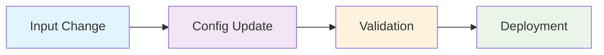

# Elastic Agent Configuration and Kubernetes Deployment

A complete CI/CD pipeline for managing Elastic Agent configurations and deploying them to Kubernetes clusters using GitHub Actions.

## 🚀 Quick Start

### Prerequisites
- GitHub repository with Actions enabled
- Kubernetes clusters with appropriate access
- Kubeconfig files stored in Vault

### Basic Usage

1. **Add/Modify Input Configuration**
   ```bash
   # Create or edit input files in subdirectories
   inputs/loc1/google_http/http_google.yml
   inputs/loc2/comcast/comcast-browser-synthetics.yml
   ```

2. **Create Pull Request**
   - Changes to `inputs/*/*/**.yml` files automatically trigger the config update workflow
   - The workflow updates the main `elastic-agent.yml` files
   - Kubernetes manifests are validated automatically

3. **Deploy to Production**
   - **Automatic**: Merge PR to main branch for automatic deployment
   - **Manual**: Use GitHub Actions "Deploy to Kubernetes" workflow


## 🏗️ Architecture

The system consists of three interconnected GitHub Actions workflows:



## Overview

The system consists of three interconnected workflows that form a complete CI/CD pipeline:

1. **Config Update Workflow** - Merges input files into main Elastic Agent configuration
2. **Validation Workflow** - Validates Kubernetes manifests after config updates
3. **Deployment Workflow** - Deploys configurations to Kubernetes clusters

## Workflow Chain Architecture

### 1. Config Update Workflow (`update_config.yml`)

**Trigger**: Pull requests with changes to `inputs/*/*/**.yml` files

**Process**:
1. **Identify Changed Files**: Detects all `.yml` files added or modified in the pull request
2. **Process Each Change**: For each changed input file:
   - **Validate Input File**: Validates YAML syntax of the changed input file
   - **Determine Location**: Finds the parent directory (e.g., `loc1`, `loc2`)
   - **Verify Main File**: Checks if `elastic-agent.yml` exists in that location
   - **Update/Append Content**: Updates existing input or appends new input to the `inputs:` section
3. **Validate Main YAML**: Validates the updated `elastic-agent.yml` file's syntax
4. **Commit Changes**: Commits changes to the pull request branch
5. **Post PR Comment**: Reports success or failure details

### 2. Validation Workflow (`validate-kubernetes-manifests.yml`)

**Trigger**: `workflow_run` - Automatically triggered when "Update Elastic Agent Config" workflow completes successfully

**Process**:
1. **Detect Affected Locations**: Identifies which folders (loc1, loc2) were modified
2. **Validate Kubernetes Manifests**: For each affected folder:
   - **Kustomization Validation**: Uses `kubectl apply -k --dry-run` to validate ConfigMap generation
   - **Deployment Validation**: Uses `kubectl apply -f --dry-run` to validate agent-deployment.yml
   - **YAML Syntax Check**: Validates all YAML files (elastic-agent.yml, kustomization.yml, agent-deployment.yml)
3. **Report Results**: Provides detailed validation results

### 3. Deployment Workflow (`deploy-kubernetes.yml`)

**Triggers**:
- `workflow_dispatch` - Manual deployment (main branch only)
- `push` - Automatic deployment on main branch

**Process**:
1. **Branch Validation**: Explicitly checks and enforces main branch restriction
2. **Detect Changes**: Identifies affected locations from recent commits
3. **Vault Integration**: Retrieves kubeconfig securely using HashiCorp Vault
4. **Deploy to Kubernetes**: For each affected location:
   - **Apply Kustomization**: Creates/updates ConfigMap from elastic-agent.yml
   - **Apply Deployment**: Deploys/updates the Elastic Agent deployment

## 📁 Project Structure

```
├── .github/workflows/
│   ├── update_config.yml              # Config update workflow
│   ├── validate-kubernetes-manifests.yml  # Validation workflow
│   └── deploy-kubernetes.yml          # Deployment workflow
├── inputs/
│   ├── loc1/
│   │   ├── elastic-agent.yml          # Main config (auto-generated)
│   │   ├── agent-deployment.yml       # Kubernetes deployment
│   │   ├── kustomization.yml          # Kustomize config
│   │   └── subdirs/
│   │       └── *.yml                  # Input configurations
│   └── loc2/
│       ├── elastic-agent.yml
│       ├── agent-deployment.yml
│       ├── kustomization.yml
│       └── subdirs/
│           └── *.yml
└── README.md                          # This file
```


## 📝 Usage Examples

### Adding a New Input Configuration

1. **Create input file**:
   ```yaml
   # inputs/loc1/slb/slb-tcp-input.yml
   - type: synthetics/tcp
     id: slb-ip
   ```

2. **Create pull request**:
   ```bash
   git add inputs/loc1/slb/slb-tcp-input.yml
   git commit -m "Add slb tcp synthetics"
   git push origin input/slb
   # Create PR
   ```

3. **Automatic processing**:
   - Config update workflow merges the input into `inputs/loc1/elastic-agent.yml`
   - Validation workflow validates Kubernetes manifests
   - PR shows auto-generated changes for review

4. **Deploy**:
   - **Auto**: Merge PR to main branch
   - **Manual**: Run "Deploy to Kubernetes" workflow

### Manual Deployment

1. Navigate to **Actions** → **Deploy to Kubernetes**
2. Click **Run workflow**
3. Select **main** branch (required)
4. Click **Run workflow**