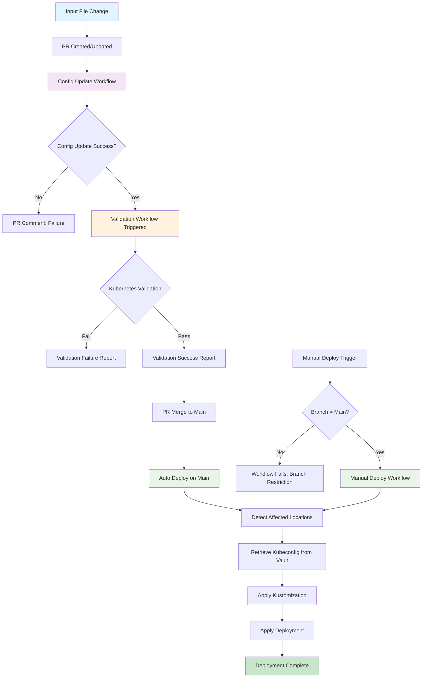
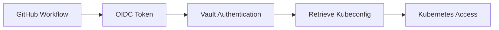

# Elastic Agent Configuration and Kubernetes Deployment Workflows

This document outlines the architecture of the GitHub Actions workflows designed to automate the complete lifecycle from Elastic Agent configuration updates to Kubernetes deployment.

## Overview

The system consists of three interconnected workflows that form a complete CI/CD pipeline:

1. **Config Update Workflow** - Updates Elastic Agent configuration files
2. **Validation Workflow** - Validates Kubernetes manifests after config updates
3. **Deployment Workflow** - Deploys configurations to Kubernetes clusters

## Workflow Chain Architecture

### 1. Config Update Workflow (`update_config.yml`)

**Trigger**: Pull requests with changes to `inputs/*/*/**.yml` files

**Process**:
1. **Identify Changed Files**: Detects all `.yml` files added or modified in the pull request
2. **Process Each Change**: For each changed input file:
   - **Validate Input File**: Validates YAML syntax of the changed input file
   - **Determine Location**: Finds the parent directory (e.g., `loc1`, `loc2`)
   - **Verify Main File**: Checks if `elastic-agent.yml` exists in that location
   - **Update/Append Content**: Updates existing input or appends new input to the `inputs:` section
3. **Validate Main YAML**: Validates the updated `elastic-agent.yml` file's syntax
4. **Commit Changes**: Commits changes to the pull request branch
5. **Post PR Comment**: Reports success or failure details

### 2. Validation Workflow (`validate-kubernetes-manifests.yml`)

**Trigger**: `workflow_run` - Automatically triggered when "Update Elastic Agent Config" workflow completes successfully

**Process**:
1. **Detect Affected Locations**: Identifies which locations (loc1, loc2) were modified
2. **Validate Kubernetes Manifests**: For each affected location:
   - **Kustomization Validation**: Uses `kubectl apply -k --dry-run` to validate ConfigMap generation
   - **Deployment Validation**: Uses `kubectl apply -f --dry-run` to validate agent-deployment.yml
   - **YAML Syntax Check**: Validates all YAML files (elastic-agent.yml, kustomization.yml, agent-deployment.yml)
3. **Report Results**: Provides detailed validation results

### 3. Deployment Workflow (`deploy-kubernetes.yml`)

**Triggers**:
- `workflow_dispatch` - Manual deployment (main branch only)
- `push` - Automatic deployment on main branch

**Branch Restriction**: Enforced at job level with `if: github.ref == 'refs/heads/main'`

**Process**:
1. **Branch Validation**: Explicitly checks and enforces main branch restriction
2. **Detect Changes**: Identifies affected locations from recent commits
3. **Vault Integration**: Retrieves kubeconfig securely using HashiCorp Vault
4. **Deploy to Kubernetes**: For each affected location:
   - **Apply Kustomization**: Creates/updates ConfigMap from elastic-agent.yml
   - **Apply Deployment**: Deploys/updates the Elastic Agent deployment
   - **Location Mapping**: loc1 → cluster1, loc2 → cluster2

## Security and Access Control

### Vault Integration
- **Purpose**: Secure retrieval of kubeconfig for cluster access
- **Implementation**: Uses `hashicorp/vault-action@v2`
- **Authentication**: JWT-based authentication with GitHub OIDC
- **Secrets**: Kubeconfig stored securely in Vault paths

### Branch Protection
- **Config Updates**: Only via pull requests
- **Deployment**: Restricted to main branch only
- **Manual Deployment**: Explicit branch checking with clear error messages

## File Structure and Components

### Input Configuration
```
inputs/
├── loc1/
│   ├── elastic-agent.yml          # Main configuration file
│   ├── agent-deployment.yml       # Kubernetes deployment manifest
│   ├── kustomization.yml          # Kustomize configuration
│   └── subdirs/
│       └── *.yml                  # Input configuration files
└── loc2/
    ├── elastic-agent.yml
    ├── agent-deployment.yml
    ├── kustomization.yml
    └── subdirs/
        └── *.yml
```

### Kustomization Strategy
- **ConfigMap Generation**: `kustomization.yml` generates ConfigMaps from `elastic-agent.yml`
- **Deployment Separation**: `agent-deployment.yml` is applied separately (not included in kustomization)
- **Resource Management**: Clear separation between configuration and deployment resources

## Workflow Visualization



## How It Works

### End-to-End Workflow Example

Let's walk through a complete example of how the system works from start to finish:

#### Scenario: Adding a New HTTP Input Configuration

**Step 1: Developer Makes Changes**
```bash
# Developer creates/modifies an input file
inputs/loc1/google_http/http_google.yml
```

**Step 2: Pull Request Creation**
- Developer creates a PR with the new/modified input file
- GitHub detects changes to `inputs/*/*/**.yml` pattern
- **Config Update Workflow** is automatically triggered

**Step 3: Config Update Workflow Execution**
```yaml
# Workflow detects: inputs/loc1/google_http/http_google.yml
# Location identified: loc1
# Target file: inputs/loc1/elastic-agent.yml
```

The workflow:
1. Validates the input YAML syntax
2. Reads the content from `http_google.yml`
3. Appends/updates the input in `inputs/loc1/elastic-agent.yml`
4. Validates the updated `elastic-agent.yml`
5. Commits changes back to the PR branch
6. Posts a success comment on the PR

**Step 4: Automatic Validation**
- **Validation Workflow** is triggered via `workflow_run`
- Detects that `loc1` was affected
- Validates Kubernetes manifests:
  ```bash
  kubectl apply -k inputs/loc1/ --dry-run=client
  kubectl apply -f inputs/loc1/agent-deployment.yml --dry-run=client
  ```
- Reports validation results

**Step 5: PR Review and Merge**
- Developer reviews the auto-generated changes
- PR is approved and merged to main branch

**Step 6: Automatic Deployment**
- **Deployment Workflow** triggers on push to main
- Detects `loc1` was affected in recent commits
- Retrieves kubeconfig from Vault for cluster1
- Applies changes:
  ```bash
  kubectl apply -k inputs/loc1/          # Creates/updates ConfigMap
  kubectl apply -f inputs/loc1/agent-deployment.yml  # Updates deployment
  ```

#### Alternative: Manual Deployment

**Manual Trigger Process**:
1. Navigate to Actions → Deploy to Kubernetes
2. Click "Run workflow"
3. Select branch (must be `main`)
4. Click "Run workflow"

**Branch Restriction Enforcement**:
```yaml
# If non-main branch selected:
❌ This workflow can only be run on the main branch
Current branch: refs/heads/feature-branch
Required branch: refs/heads/main
```

### Key Operational Patterns

#### 1. Configuration Management
- **Input Files**: Individual YAML files in subdirectories
- **Aggregation**: Automatically merged into main `elastic-agent.yml`
- **Validation**: Multi-layer validation (syntax, Kubernetes compatibility)

#### 2. Location-Based Deployment
```
inputs/loc1/ → cluster1 (via kubeconfig from vault/loc1/kubeconfig)
inputs/loc2/ → cluster2 (via kubeconfig from vault/loc2/kubeconfig)
```

#### 3. Resource Separation
- **ConfigMap**: Generated via kustomization from `elastic-agent.yml`
- **Deployment**: Applied separately from `agent-deployment.yml`
- **Benefits**: Independent updates, cleaner resource management

#### 4. Security Flow


### Error Handling and Recovery

#### Common Scenarios and Responses

**1. Invalid YAML Syntax**
```
❌ Config Update Workflow fails
📝 PR comment posted with syntax error details
🔄 Developer fixes and pushes again
```

**2. Kubernetes Validation Failure**
```
❌ Validation Workflow fails
📝 Detailed kubectl dry-run error reported
🔄 Developer reviews and fixes manifest issues
```

**3. Deployment on Wrong Branch**
```
❌ Deployment Workflow blocked
📝 Clear error message about branch restriction
🔄 User must switch to main branch
```

**4. Vault Authentication Issues**
```
❌ Deployment fails at kubeconfig retrieval
📝 Vault authentication error logged
🔧 Check OIDC configuration and Vault policies
```

### Monitoring and Observability

#### Workflow Status Tracking
- **Config Updates**: PR comments provide immediate feedback
- **Validation**: Workflow run logs show detailed validation results
- **Deployment**: Kubernetes apply output shows resource status

#### Key Metrics to Monitor
- **Success Rate**: Percentage of successful config updates
- **Validation Failures**: Common Kubernetes manifest issues
- **Deployment Frequency**: How often deployments occur
- **Branch Restriction Violations**: Attempts to deploy from non-main branches

### Best Practices for Users

#### For Developers
1. **Test Locally**: Validate YAML syntax before creating PR
2. **Small Changes**: Make incremental changes for easier troubleshooting
3. **Review Auto-Changes**: Always review the auto-generated `elastic-agent.yml` changes

#### For Operations
1. **Monitor Vault**: Ensure kubeconfig secrets are up-to-date
2. **Cluster Health**: Verify target clusters are accessible
3. **Branch Protection**: Maintain main branch protection rules

#### For Security
1. **Vault Policies**: Regularly review and update Vault access policies
2. **OIDC Configuration**: Monitor GitHub OIDC trust relationships
3. **Audit Logs**: Review deployment logs for unauthorized access attempts